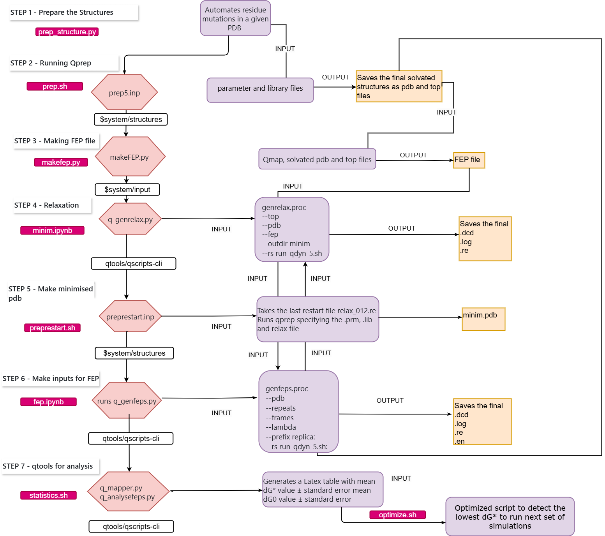

# Free Energy Perturbation (FEP) Workflow Guide

This guide presents a complete, automated workflow for conducting **Free Energy Perturbation (FEP)** calculations using the **Q6 software suite**. It covers all steps from initial structure preparation through final statistical analysis of free energy differences between protein variants.



# This workflow is generated using GPX6 protein as a model

---

## Environment & Dependencies


| Tool | Purpose |
|------|--------|
| [Q6](https://github.com/qusers/Q6) | FEP/MD engine (`qprep6`, `qdyn6`, `qfep6`) |
| [PyMOL](https://pymol.org/) | Structure preparation and mutation |
| [Qtools](https://github.com/mpurg/qtools) | FEP analysis (`q_mapper.py`, `q_analysefeps.py`) |
| Python 3.8 | Programming environment |
| OPLS-AA | Force field |

---

## Installation

Clone the repository and install the required Python packages:

```bash
git clone https://github.com/ND7996/GPX6.git
cd GPX6
pip install -r requirements.txt
```

> **Note:** Q5, PyMOL, and Qtools must be installed separately — see their respective links in the table above.

---

## Starting Structures

| System | Source | Identifier |
|--------|--------|------------|
| Mouse GPX6 | Experimental (X-ray) | [PDB: 7FC2](https://www.rcsb.org/structure/7FC2) |
| Human GPX6 | AlphaFold model | As described in the manuscript |

Both structures were mutated using PyMOL automation (Step 1) to generate the variant panel used in this study.

---

## Simulation Parameters

Full simulation protocol, parameters, and convergence analysis are described in detail in the associated manuscript.

---

## Workflow Overview

This pipeline automates the calculation of binding free energy differences through a structured 7-step process involving:

1. Structure Preparation
2. System Solvation
3. FEP Setup
4. Molecular Dynamics (MD) Relaxation
5. Structure Minimization
6. FEP Input Generation
7. Statistical Analysis

---

## STEP 1 - Structure Preparation

### Purpose

Automates point mutations in a PDB structure using PyMOL.

### Details

- **Tool**: PyMOL automation script
- **Function**: Introduces predefined mutations (e.g., mouse-to-human substitutions or SEC incorporation)
- **Output**: Individual PDB files for each variant

### Features

- Automated mutation mapping
- Preserves backbone integrity
- Ensures mutation compatibility
- Consistent output naming

---

## STEP 2 - Solvation with Qprep

### Purpose

Prepares solvated systems and topologies for MD relaxation.

### Process

1. Extracts base name from each PDB file
2. Generates `.inp` file and runs `qprep6`
3. Applies solvation and boundary conditions

### Output

- `${base_name}_solvated.pdb`
- `${base_name}_solvated.top`

### Specifications

- **Solvation**: Explicit water model
- **Boundary Conditions**: Spherical
- **Force Field**: OPLS-AA

---

## STEP 3 - FEP File Generation

### Purpose

Uses `makeFEP.py` to create lambda-dependent FEP input files.

### Inputs

| File | Role |
|------|------|
| `fepmousecys.qmap` | Mapping for mouse WT |
| `fephumansec.qmap` | Mapping for human WT |

### Output

- FEP files with initial/final state mappings and perturbation parameters across 51 lambda windows

---

## STEP 4 - Relaxation Input Setup

### Purpose

Generates input files for energy minimization and equilibration.

### Required Inputs

- `--genrelax.proc`: Relaxation parameters
- `--top`: Topology file
- `--pdb`: Solvated structure
- `--fep`: FEP file
- `--outdir minim`: Output folder
- `--rs run_qdyn6.sh`: Qdyn execution script

### Steps

- Validates inputs
- Generates `.inp` files
- Creates run scripts
- Organizes output structure

---

## STEP 5 - Minimized PDB for FEP

### Purpose

Performs energy minimization and prepares PDBs for FEP simulations.

### Process

1. Scans system directories
2. Locates `relax_012.re` restart files
3. Runs relaxation and prepares minimized structures

### Output

- `minim.pdb` saved in each system folder

### Quality Checks

- Convergence validation
- Energy profile checks
- Structural integrity

---

## STEP 6 - FEP Input Generation

### Purpose

Generates complete FEP simulation input sets with replica support.

### Required Inputs

- `--genfeps.proc`: Parameters for FEP and equilibration
- `--pdb`: `minim.pdb`
- `--repeats`: 15 replicas
- `--frames`: 51
- `--fromlambda`: 1.0
- `--prefix`: `replica`
- `--rs`: Execution script

### Output

FEP-ready folders per replica inside each system directory.

---

## STEP 7 - Analysis with Qtools

### Purpose

Performs statistical evaluation of FEP results.

### Pipeline

#### 7.1 Data Mapping

- **Tool**: `q_mapper.py`
- **Function**: Aggregates lambda data across 15 replicas

#### 7.2 FEP Analysis

- **Tool**: `q_analysefeps.py`
- **Output**: `test.out` + JSON structured data

---

This pipeline is built to support automated FEP calculations in protein mutagenesis projects using the Q6 software suite.

---

## Data Availability

All scripts, input files, and parameters are available in this repository.
MPNN sequence design data are available at [github.com/ND7996/MPNN](https://github.com/ND7996/MPNN).

Raw simulation trajectories (`.dcd`, `.en`, `.log`) are currently stored on an external hard drive
connected to the university cluster and are being deposited to
[CSUC (Consorci de Serveis Universitaris de Catalunya)](https://www.csuc.cat/en) for long-term public archival.
A DOI will be added here upon completion. Raw data are available upon request to the corresponding author.
